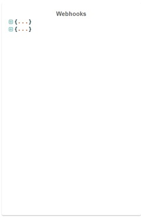
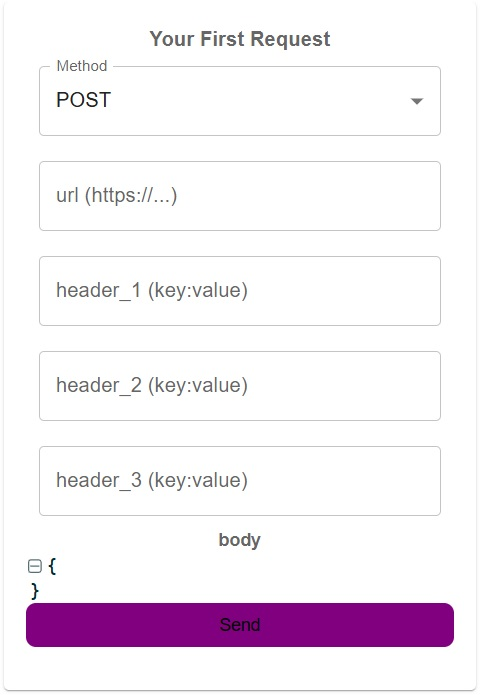
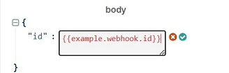
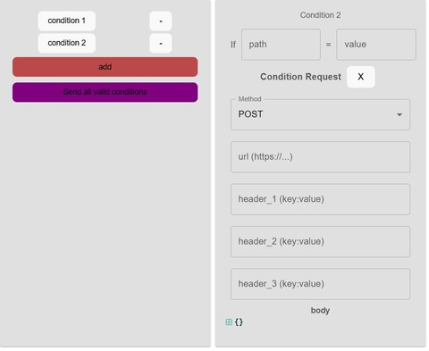

# Content of Project

- [General info](#general-info)

- [Technologies](#technologies)

- [Features](#features)

- [Setup](#setup)

## General info

The app receives webhooks, displays the data, and makes it super simple to send requests to any endpoint. You can also set conditions to decide what actions happen next.

<b>What is a Webhook?</b>

A webhook is a way for one application to send real-time data to another application whenever a specific event occurs. It works by delivering a POST request to a predefined URL (callback URL) with the relevant data.

## Technologies

<ul>

<li>React 18.3.1</li>

<li>TypeScript 5.5.3</li>

<li>React-Redux 9.1.2</li>

<li>Vite 5.4.1</li>

<li>Axios 1.7.9</li>

<li>Material UI 6.1.1</li>

<li>Firebase 10.13.2</li>

<li>React-json-view 1.21.3</li>

</ul>

## Features

#### Reciving Webhooks

To enable the application to display incoming webhooks, you need to configure your system to send webhooks to the following endpoint:

```
https://voucherifywebhook-3205f-default-rtdb.europe-west1.firebasedatabase.app/data.json
```

Once your webhook is successfully sent, it will appear in the dedicated window of the application:



#### Sending Request:

In this section, you can create your own custom request by selecting the HTTP method, defining headers, adding a body, and then sending it.



The main feature of this functionality is the ability to create a request based on an incoming webhook. If you want to reference data from the webhook in the request body, simply use double curly braces {{ }}



#### Sending Conditional Requests:

All actions related to sending conditional requests are located in windows with a gray background.



This functionality allows you to create requests that will only be sent if specific conditions are met. Each request has its own individual conditions, making the process highly customizable.

<ul>

<li>Define Conditions per Request:

Conditions are set separately for each request. This ensures precise control over when a request should be triggered.

</li>

<li>Reference the First Request:

The conditions are primarily based on the response from the first request ("your first request"). This means you can dynamically determine whether subsequent requests should be sent based on the initial response.


</li>

<li>Reference the First Request:

Just like when creating the body for your first request, you can also reference data from the first request (not the webhook!) in subsequent requests using double curly braces {{ }}.

</li>

<li>Send All Valid Requests:

After defining conditions and request content, you can use the "Send all valid conditions" button. This will send all the requests whose conditions are met, ensuring only the necessary actions are executed.

</li>

</ul>

This feature is ideal for automating workflows and building dynamic chains of requests.

## Setup

To run this project, enter the webside <b>https://galawoj.github.io/webhook_build/</b> or clone my repository:

```
git clone https://github.com/galawoj/webhook.git
```

### Starting

```
$ cd ../webhook
$ npm install
$ npm run dev
```
