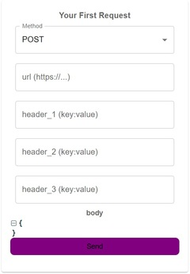

# Content of Project

- [General info](#general-info)

- [Technologies](#technologies)

- [Features](#features)

- [Setup](#setup)

## General info

The app receives webhooks, displays the data, and makes it super simple to send requests to any endpoint. You can also set conditions to decide what actions happen next.

<b>What is a Webhook?</b>

A webhook is a way for one application to send real-time data to another application whenever a specific event occurs. It works by delivering a POST request to a predefined URL (callback URL) with the relevant data.

## Technologies

<ul>

<li>React 18.3.1</li>

<li>TypeScript 5.5.3</li>

<li>React-Redux 9.1.2</li>

<li>Vite 5.4.1</li>

<li>Node.js</li>

<li>Axios 1.7.9</li>

<li>Material UI 6.1.1</li>

<li>Firebase 10.13.2</li>

<li>React-json-view 1.21.3</li>

</ul>

## Features

#### Reciving Webhooks

To enable the application to display incoming webhooks, you need to configure your system to send webhooks to the following endpoint:

```

https://voucherifywebhook-3205f-default-rtdb.europe-west1.firebasedatabase.app/data.json

```

Once your webhook is successfully sent, it will appear in the dedicated window of the application:


#### Sending Request:

In this section, you can create your own custom request by selecting the HTTP method, defining headers, adding a body, and then sending it.



The main feature of this functionality is the ability to create a request based on an incoming webhook. If you want to reference data from the webhook in the request body, simply use double curly braces {{ }}


<!-- #### Continuous Learning:

<ul>

<li><b>Contextual Learning:</b> The app continues the previous text by incorporating words you found unfamiliar, reinforcing your understanding and retention of new vocabulary.</li>

</ul> -->

## Setup

To run this project, enter the webside <b>https://galawoj.github.io/webhook_build/</b> or clone my repository:

```

git clone https://github.com/galawoj/webhook.git

```

### Starting

```

$ cd ../webhook

$ npm install

$ npm run dev

```
